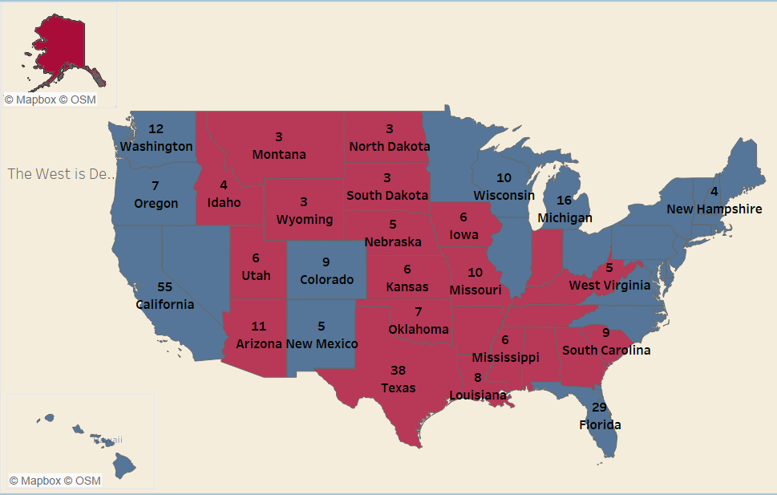

# 2016 US Presidential Election Prediction

Coursework for MIS342 (Fall Semester, 2016) at Drexel University.

## Objective

The goal of the project is to predict the result of the 2016 US Presidential Election using pollster data from FiveThirtyEight.

## Methodology

Pollster data are weighted based on 2 criterion:

##### 1. Pollster Rating on FiveThirtyEight

Pollsters with higher ratings are applied with a higher weight, vice versa. For example, pollster rated A+ has a weight of 1, pollster rated A has a weight of 0.95, etc.

##### 2. Recency

Data are discounted with the rate of 0.05 per day as recent data would likely better reflect the final election result. 

## Prediction

The dashboard below illustrates the projection of election results in each state. It was projected that Hillary Clinton will beat Donald Trump in the election by a total of 108 electoral votes.

